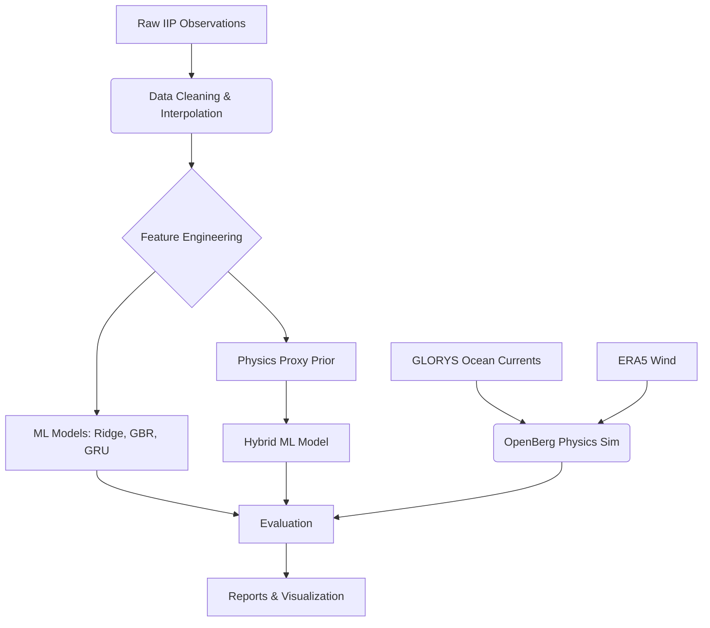

# Project Overview

## Project Name
Iceberg Trajectory Prediction System

## Project Purpose
This project is an advanced prototype system designed to predict the trajectories of drifting icebergs. The system explores a hybrid approach, combining physics-based oceanographic simulations (OpenBerg/OpenDrift) with data-driven Machine Learning (ML) models (Ridge Regression, Gradient Boosting, GRU) to forecast iceberg displacements based on historical observations and environmental forcing (ocean currents and wind).

## Problem Statement
Predicting the path of drifting icebergs is critical for maritime safety and offshore operations. Traditional physics-based models require highly accurate environmental forcing data (ocean currents, wind) and precise iceberg geometry (mass, draft, sail), which are often unavailable or highly uncertain in operational settings. Pure ML models can learn empirical drift patterns but lack physical constraints.

## Proposed Solution
This repository implements a multi-model prototype to evaluate and compare different approaches:
1. **Pure Physics Baseline:** Using OpenBerg (an OpenDrift module) driven by Copernicus GLORYS ocean currents and ERA5 wind data.
2. **Machine Learning Baselines:** Persistence, Ridge Regression, Gradient Boosting, and GRU models trained on historical trajectory sequences.
3. **Hybrid Physics + ML Model:** An approach that uses a physics-informed prior (a scaled-persistence forecast acting as a proxy for physical advection) and trains an ML residual correction model (Gradient Boosting) on top of it.

## Major Technologies
* **Python 3**
* **Physics Simulation:** OpenDrift / OpenBerg
* **Machine Learning:** Scikit-Learn, XGBoost, PyTorch (GRU)
* **Data Processing:** Pandas, NumPy, xarray, netCDF4, PyArrow

## Datasets
* **IIP (International Ice Patrol):** Historical iceberg observations (positions and times).
* **Copernicus GLORYS12V1:** Historical ocean current reanalysis (Mode 1).
* **Copernicus GLO12 Analysis/Forecast:** Operational forecast ocean currents (Mode 2).
* **ERA5:** Hourly single-level wind reanalysis.

## Current Prototype Status & Limitations
This system is currently an **experimental prototype**. 
* **Prediction Limitation:** True unseen real-world operational prediction from a single arbitrary observation is **not yet fully implemented**. The ML pipeline requires a sequence of historical observations to generate lag features. 
* **Physics Integration:** Full OpenBerg integration for every iceberg in the ML population is computationally prohibitive right now; thus, the Hybrid model uses a "physics proxy" (scaled persistence) rather than a full GLORYS/ERA5-driven OpenBerg simulation for the baseline of every sample.
* **OpenBerg Reference:** The full OpenBerg integration is validated primarily as a reference on single icebergs (e.g., Iceberg 20857).

