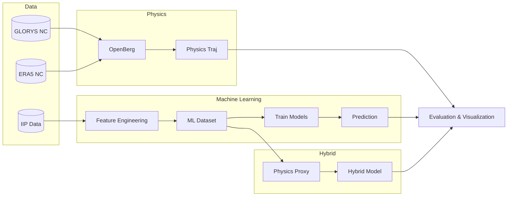

# System Architecture

The Iceberg Trajectory Prediction System is structured into several conceptual layers, combining data ingestion, physics-based simulations, and machine learning pipelines.

## 1. Data Layer
* **Input:** Raw IIP tabular observation data (CSV), Copernicus GLORYS12V1 (NetCDF), ERA5 Wind (NetCDF).
* **Processing:** Handled by `prepare_iip_20857.py`, `prepare_iip_2021_catalog.py`, etc.
* **Output:** Cleaned datasets and trajectory catalogs in CSV and Parquet formats.

## 2. Preprocessing & Feature Engineering Layer
* **Input:** Cleaned trajectory data.
* **Processing:** `build_ml_dataset.py`, `build_trajectory_segments.py`. Extracts sequential lag features (e.g., `prev_delta_lat`, `prev_delta_lon`, `prev_dt_hours`), and computes target displacements.
* **Output:** `data/ml/final_ml_dataset.parquet` and config/schema JSONs.

## 3. Environmental Forcing Layer
* **Input:** Copernicus APIs and CDS APIs.
* **Processing:** Configured in `dataset_config.py`. Maps variables (e.g., `uo`, `vo`, `u10`, `v10`) to standard CF conventions for OpenDrift.
* **Output:** Local NetCDF files for simulation.

## 4. Physics Simulation Layer
* **Input:** Environmental NetCDFs and initial iceberg states.
* **Processing:** OpenBerg (via OpenDrift). Executes trajectory simulations (`real_run.py`, `historical_validation.py`, `openberg_vector_sanity_test.py`).
* **Output:** Simulated trajectories (`.nc`, `.csv`).

## 5. ML Training Layer
* **Input:** Engineered ML dataset.
* **Processing:** `train_baseline_models.py`, `train_gru_model.py`, `train_hybrid_model.py`. Splits data (train/val/test) by iceberg ID to prevent data leakage. Fits models (Ridge, GBR, GRU).
* **Output:** Trained model artifacts (`.joblib`, `.pt`) in the `models/` directory.

## 6. Prediction Layer
* **Input:** New observation sequences (for ML) or initial state (for physics).
* **Processing:** Loads saved models/scalers and applies them to features. *Note: Fully autonomous prediction from a single raw input is limited in the current prototype.*
* **Output:** Predicted delta latitude / delta longitude.

## 7. Evaluation & Reporting Layer
* **Input:** Ground truth test data vs. predictions.
* **Processing:** `final_evaluation.py`, `generate_reports.py`. Computes geodesic error using Haversine formula.
* **Output:** Error metrics (Mean, Median, RMSE, Max in km), JSON results, markdown reports, and PNG plots (`figures/`).

## Architecture Diagram

