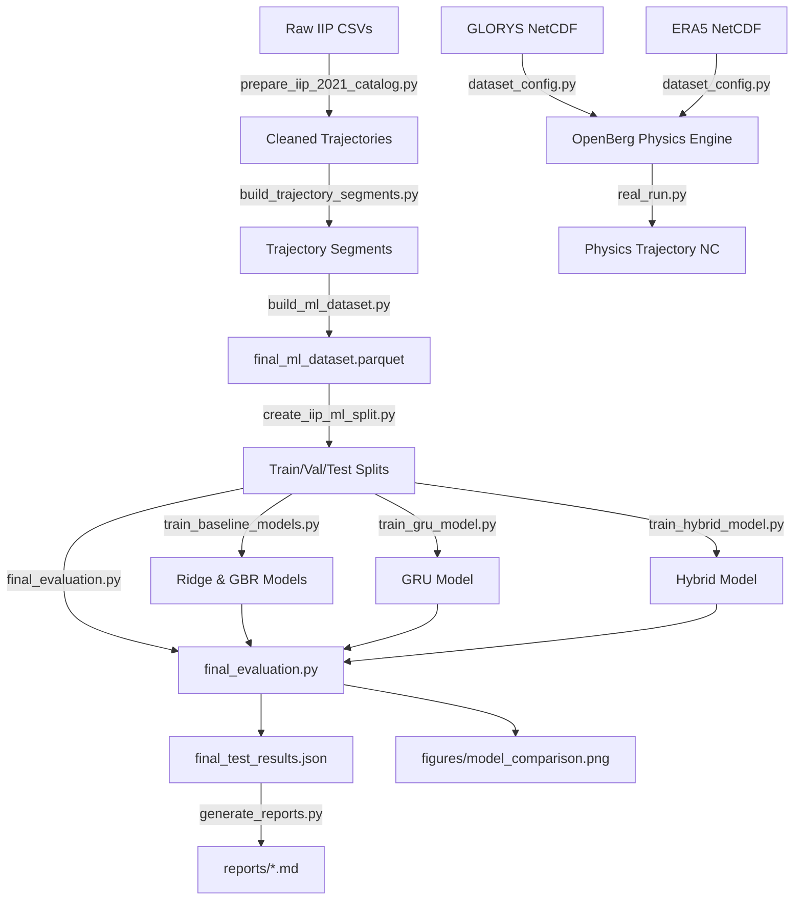

# Complete Project Map

This diagram illustrates the exact file flow of the entire Iceberg Trajectory Prediction System.

```mermaid
flowchart TD
    %% Inputs
    IIP[Raw IIP CSVs]
    GLORYS[GLORYS NetCDF]
    ERA5[ERA5 NetCDF]

    %% Data Prep
    IIP -->|prepare_iip_2021_catalog.py| CleanedIIP[Cleaned Trajectories]
    
    %% ML Feature Engineering
    CleanedIIP -->|build_trajectory_segments.py| Segments[Trajectory Segments]
    Segments -->|build_ml_dataset.py| MLData[final_ml_dataset.parquet]
    
    %% Splitting
    MLData -->|create_iip_ml_split.py| SplitData[Train/Val/Test Splits]
    
    %% ML Training
    SplitData -->|train_baseline_models.py| Baselines[Ridge & GBR Models]
    SplitData -->|train_gru_model.py| GRU[GRU Model]
    SplitData -->|train_hybrid_model.py| Hybrid[Hybrid Model]
    
    %% Physics Simulation
    GLORYS -->|dataset_config.py| OpenBerg[OpenBerg Physics Engine]
    ERA5 -->|dataset_config.py| OpenBerg
    OpenBerg -->|real_run.py| PhysSim[Physics Trajectory NC]

    %% Evaluation
    SplitData -->|final_evaluation.py| Eval[final_evaluation.py]
    Baselines --> Eval
    GRU --> Eval
    Hybrid --> Eval
    
    %% Output
    Eval --> JSONOut[final_test_results.json]
    Eval --> FigOut[figures/model_comparison.png]
    
    %% Reporting
    JSONOut -->|generate_reports.py| Markdown[reports/*.md]
```
